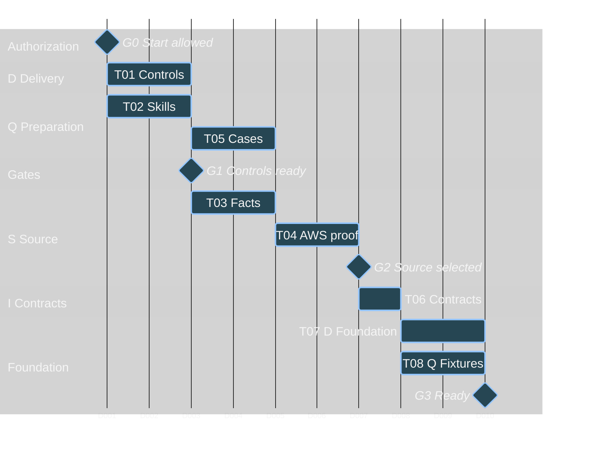
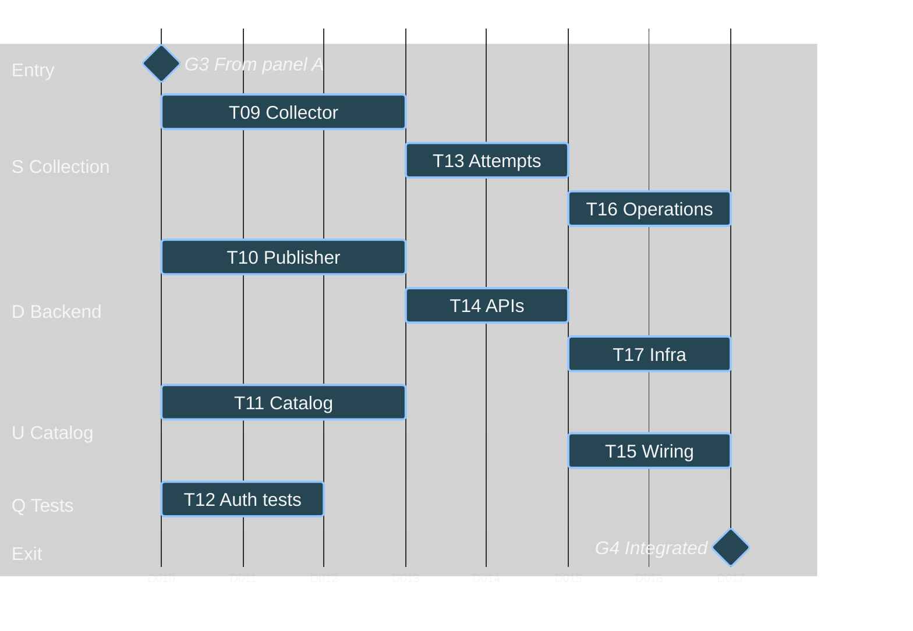
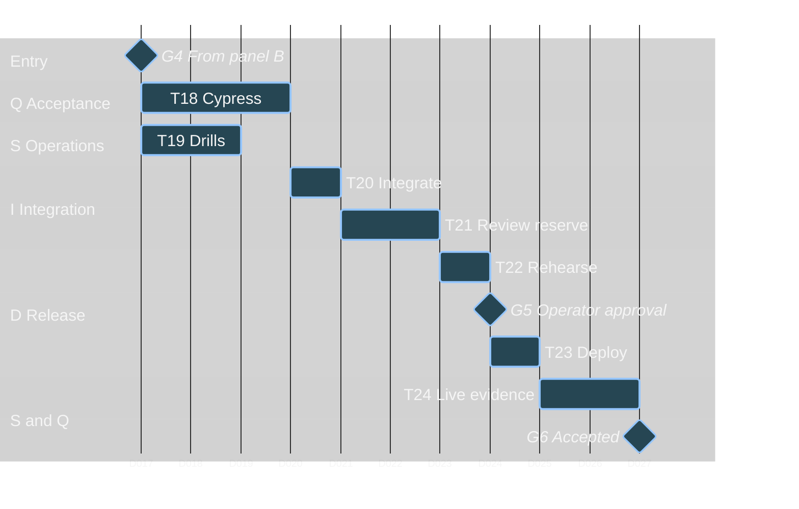

# LEGO Retirement Tracker: Subagent Work Plan

## 1. Purpose and status

Break the approved operating concept in [plan.md](./plan.md) into bounded tasks, explicit handoffs, and a dependency-aware parallel execution schedule.

**Planning only.** Creating this document does not start implementation, dispatch implementation subagents, install dependencies, authorize repository publication, provision cloud resources, or approve a release. All tasks T01-T24 below are pending. The existing workspace setup and bounded local acquisition research are completed prerequisites, not newly completed implementation tasks.

The saved [CONOPS](./plan.md) is the requirements authority. This companion does not replace it or change its decisions:

- Include every product in the official US category, including merchandise; exclude promotional placements. Do not collect product themes.
- Use one card per product, expandable variants, honest price ranges, lowest-known-current-price sorting with unknowns last in either direction, and any-variant discount filtering.
- Publish only complete validated scans. Failed attempts retain diagnostics and restart from page one; no page-level resume or cross-attempt mixing.
- Preserve coherent active/archive snapshots, fenced publication, last-good data, explicit freshness, and visible failures.
- Use Next.js/TypeScript, Amplify **Gen 2**, invite-only Cognito, and isolated test environments.
- Require Habit Hooks, meaningful tests, actual current-head independent GitHub Copilot approval, and explicit production authorization. Use Cypress AI Skills, not Cypress Cloud AI or `cy.prompt`.

Local API/HTML evidence supports a provisional API collector, but AWS-hosted acquisition, variant/availability equivalence, workload permissions, review enforcement, and alert delivery remain qualification work. The [selected deployment targets](./plan.md#selected-delivery-and-deployment-targets) are already decided; their selection is not proof of working integrations.

## 2. Subagent lanes and ownership

Use **at most four active specialist subagents**, plus an integration lead. Reuse the same specialist for successive tasks in its lane. Do not create additional agents merely to reread completed work or substitute for the independent GitHub reviewer.

| Lane | Responsibility | Exclusive write boundary during implementation |
|---|---|---|
| I - Integration lead | Recommend workspace/worktree isolation, dispatch ready tasks, freeze interfaces, manage handoffs, assemble evidence, coordinate authorized Git/PR operations | Shared domain contracts until frozen; integration changes only after affected owners relinquish their files |
| D - Delivery and backend | Tooling, Next.js/Gen 2 foundation, identity, persistence, publication, APIs, infrastructure, release mechanics | Root manifests/lockfiles/configuration, CI, `amplify/**`, server auth/data/API modules, shared telemetry helpers |
| S - Source and operations | Acquisition qualification, collector, attempt orchestration, operational policies, incident evidence | Collector modules and sanitized source fixtures; operational handler/policy modules, not shared infrastructure definitions |
| U - Operator UI | Catalog, variants, archive, status/error presentation, accessible responsive flows | UI routes/components/styles; excludes server API route handlers and shared contracts |
| Q - Verification | Acceptance cases, shared behavior fixtures, Cypress support, real-backend integration tests | `cypress/**`, integration tests, deterministic behavior fixtures; module-local unit tests remain with their implementation owner |
| R - Independent GitHub Copilot reviewer | Review scoped PRs and the final integrated head; require fixes and re-review | Review findings and approval only; not an implementation subagent or a self-approval mechanism |
| Operator | Scope decisions, explicit worktree-creation approval, protected settings, scoped resource access, defaults review, production authorization | Human approval boundaries; no delegation of these decisions to a coding agent |

These paths are proposed ownership boundaries, not existing or newly created application files. Finalize actual paths in T06/T07 after scaffolding choices are inspected. D transfers ownership of initial UI scaffolding to U before T11; API handlers remain D-owned.

### Collision and resource rules

1. **I (integration lead) recommends whether to use worktrees; the operator authorizes their creation.**
   - **When:** I assesses isolation before the first parallel dispatch after G0, confirms the arrangement during T06 before the G3 feature phase, and revisits it when task ownership or branch/build-state conflicts arise.
   - **Criteria:** use the current session/workspace when nonoverlapping ownership and serialized shared-file edits suffice. Recommend task-scoped worktrees only when otherwise independent tasks need separate branch or build state; do not allocate one automatically per subagent. Worktrees do not remove integration conflicts or relax single-writer ownership.
   - **Action:** the integration lead coordinates setup, assignments, base revisions, and integration order only after an explicit operator request/approval to create the proposed worktrees. Specialists do not create their own. General implementation approval is not worktree authorization; without it, retain the shared workspace and serialize conflicting work. Separate cloud environments still require their own scoped approval.
2. Only the integration lead performs authorized branch/index/commit/PR operations. Specialists do not concurrently switch branches, stage files, commit, or publish.
3. D is the single writer for dependencies, lockfiles, shared build configuration, CI, and infrastructure entry points. Other lanes submit a bounded change request; D applies it between coherent edits. Never run an install while another lane is changing its manifest or lockfile.
4. Freeze shared product, variant, snapshot, run, error, and operation contracts in T06. Consumers may request a contract revision, not silently fork or cast around it. The lead pauses affected dependants and coordinates migration and regression tests.
5. Prefer module-local tests owned by the implementer; Q owns cross-module tests. No two agents edit the same test fixture or integration file simultaneously.
6. D provides shared error-reporting/log-sanitization helpers; S and U reuse them. Inspect existing helpers first. Encode or remove input newlines before logging, exclude credentials/account payloads, and surface failures through Sentry and/or the UI.
7. Permit one bounded live-source qualification run at a time. Routine parallel tests use sanitized fixtures, not separate live LEGO crawls.
8. Q's acceptance tests and S's fault drills must use separate nonproduction state/identities or run serially. Never inject failures into a backend another lane is asserting against. Additional environments require scoped approval, not automatic provisioning.

## 3. Authorization and integration gates

Tasks start only when their hard predecessors are accepted **and** applicable authority is available. Elapsed time never opens a gate.

| Gate | Required evidence or decision | Work it permits |
|---|---|---|
| G0 - Implementation authorization | Operator explicitly authorizes implementation and its local tooling changes; repository publication/protected-setting changes require their own authority | Begin T01/T02; this document does not open G0 |
| G1 - Delivery baseline | T01/T02 deliver pinned tooling, tested blocking behavior, selected skill discovery, and a trusted current-head review-gate design/enforcement demonstration | Begin the remaining source qualification and acceptance-case work |
| G-AWS - Qualification resources | Operator authorizes bounded nonproduction AWS execution, role, resource/cost limits, evidence retention, and cleanup | Execute the AWS portion of T04; local STS access alone is insufficient |
| G2 - Acquisition decision | T04 passes source correctness and AWS execution criteria; selected runtime and remaining uncertainty are recorded | Freeze implementation contracts in T06, also requiring T05 |
| G-NP - Nonproduction integrations | Explicit scope for isolated Gen 2 backend/identities, CI role, Sentry/Slack test routing, SNS subscription, and test notifications | Cloud/integration portions of T07, T12, T17-T19, and T22; no production access |
| G3 - Foundation and fixtures | T07/T08 supply a building, typed, isolated foundation, authorization boundaries, and common deterministic fixtures | Start parallel collector, publisher, UI, and authentication-test implementation |
| G4 - Integrated candidate | T12/T15/T16/T17 interfaces are wired; applicable component tests pass and schedules remain disabled outside authorized production | Begin full acceptance tests and isolated incident drills |
| G5 - Release authorization | T20-T22 demonstrate current-head checks/approval, reviewed operating defaults, staging evidence, rollback compatibility, and operator approval of the exact revision/configuration | T23 may deploy only that revision within the approved production scope |
| G6 - Operational acceptance | T24 demonstrates durable live publication, served data, actual scheduled execution, freshness/alert behavior, and recovery evidence | Declare the delivered system operational; deployment completion alone is insufficient |

Delivery controls are bootstrapped with nonempty, representative control-verification fixtures. Application build and real-backend Cypress evidence must be added as those targets become available; before then they remain unproven, not green or waived. Failure to demonstrate the selected native Copilot approval gate blocks delivery; do not substitute a comment-only review.

## 4. Dependency-aware task breakdown

### Schedule assumptions

- **One unit is one focused working-day-sized planning slot**, not an agent runtime measurement. Durations are initial estimates including local tests and a handoff, not measured productivity or a delivery promise.
- D01 starts only after G0 opens. Slots are sequential working slots; no calendar start date, weekends, or staffing commitment is implied.
- Four specialist lanes are the capacity limit. The lead coordinates rather than taking a fifth concurrent feature stream.
- Approval, access, provisioning, external review queues, source blocking, and waiting for a real scheduled run can extend the schedule. The review reserve is not a deadline to declare approval.
- The nominal schedule is **26 slots plus external waits**. Re-estimate after T04 and T07, and whenever a contract or acquisition decision changes. Do not add agents to conceal a blocked dependency.

### A. Delivery, qualification, and foundation

| ID | Owner; effort; slots | Hard predecessors | Bounded deliverable and exit evidence |
|---|---|---|---|
| T01 | D; 2 units; D01-D02 | G0 | Establish agent/reviewer instructions, pinned development/CI tooling, tested Habit Hooks release and compatible Python runtime, TypeScript/generic plugins and detectors, readability limits, and trusted review/check enforcement. Exercise findings, tool failure, empty scope, stale approval, and protected-setting failure paths. Python 3.11 is a minimum, not a selected pin. |
| T02 | Q; 2 units; D01-D02 | G0 | Inspect/pin the official Cypress AI Skills revision; verify discovery of author/explain/docs skills and document tap compatibility. Define nonempty/skip-resistant behavior-test gates and submit CI/config requirements to D. No Cloud AI or `cy.prompt`; defer actual app-session/tap verification to T12. |
| T03 | S; 2 units; D03-D04 | T01, T02; G1 | Reuse the existing research evidence; close the remaining variant, availability, price/currency, and required-field consistency gaps against rendered category results. Record source mutation and access-stop behavior. Preserve original failure evidence; do not restart already completed research without a concrete gap. |
| T04 | S; 2 units; D05-D06 | T03; G-AWS | Qualify the provisional API from the intended AWS runtime in `us-east-1`, without personal session credentials. Demonstrate full pagination, resource bounds, full-restart feasibility, and explicit failures. Record runtime/IAM/cost observations, collector decision, and cleanup. No silent HTML/browser fallback. |
| T05 | Q; 2 units; D03-D04 | T01, T02; G1 | Turn AC-01 through AC-11 into executable-case designs and a fixture inventory, including variants, unknown prices, absence/reappearance, partial runs, concurrency, and stale/error states. This is test preparation, not feature implementation before source selection. |
| T06 | I; 1 unit; D07 | T04, T05; G2 | Freeze typed contracts and acceptance examples: product/variant facts, money/currency, coherent snapshots, scheduled-check versus attempt identity, run health, authorized commands, publication/storage ports, and telemetry events. Record exact file ownership and interfaces that let downstream lanes work independently. |
| T07 | D; 2 units; D08-D09 | T06; G-NP | Scaffold Next.js/TypeScript and Amplify Gen 2; implement invite-only Cognito boundaries, isolated environments, least-privilege CI/workload access, typed persistence/runtime scaffolding, and shared error helpers. Build/type-check and prove real allowed/denied authentication paths. Leave collection schedules disabled. |
| T08 | Q; 2 units; D08-D09 | T06 | Create deterministic contract-shaped fixture factories, isolated seeds, clock controls, and validation helpers. Verify them through the delivery test runner. Do not require an unfinished live collector, and never expose fixture data as a successful live publication. |

### B. Parallel feature construction

| ID | Owner; effort; slots | Hard predecessors | Bounded deliverable and exit evidence |
|---|---|---|---|
| T09 | S; 3 units; D10-D12 | T07, T08; G3 | Implement bounded acquisition, normalization, category-specific extraction, pagination and retained-field validation. Preserve all product/variant facts, exclude promotions/themes, and report access/schema failures explicitly. Parser/contract tests cover unknown fields, currency conflicts, duplicates, mutation, incomplete traversal, and every applicable request limit. |
| T10 | D; 3 units; D10-D12 | T07, T08; G3 | Implement run-scoped storage, leases/fencing, idempotent staging, reconciliation, quarantine, and conditional publication of active/archive state. Test concurrency, interruptions, superseded runs, archival/reappearance, and the exact missing-product threshold. Partial evidence cannot update prices, membership, last-seen, or successful freshness. |
| T11 | U; 3 units; D10-D12 | T07, T08; G3 | Build the authenticated catalog/archive UI against the frozen read contract and explicit development fixtures. Implement one card per product, variant expansion, price ranges/unknowns, discount indicators, full-catalog query controls, responsive/keyboard flows, and all empty/loading/stale/failure states. These fixtures are not integration evidence. |
| T12 | Q; 2 units; D10-D11 | T07, T08; G3, G-NP | Establish real-backend Cypress auth tests, independent setup/teardown, stable selectors, retryable waits, and nonzero-test reporting. Verify selected skills activate against the actual project; exercise tap only with a compatible version/browser/session. D integrates required Amplify/CI wiring; headless CI remains ordinary Cypress. |
| T13 | S; 2 units; D13-D14 | T09, T10 | Connect collector and publisher through the accepted ports. Implement scheduled-check identity, isolated attempts, fenced lease release/reacquisition, retry eligibility/backoff, deadlines, and terminal run health. Prove every retry starts at page one with a new run ID and cannot reset the shared count/time budget. |
| T14 | D; 2 units; D13-D14 | T10 | Implement authorized snapshot-consistent full-catalog queries, archive/run-health reads, and pause/rerun command endpoints. Use the frozen runner command interface; no privileged source-fact edits or validation bypass. Test authorization, query/price semantics, pagination under concurrent publication, and visible/reportable read failures. |
| T15 | U; 2 units; D15-D16 | T11, T13, T14 | Replace development adapters with real authenticated reads/commands. Prove full-dataset search/filter/sort, variant availability, archived prices, attempted versus published timestamps, run-control authorization, and explicit read/collection failures. Verify mobile and keyboard behavior against the built app. |
| T16 | S; 2 units; D15-D16 | T13 | Implement freshness/missed-publication monitoring, retry/paused-state reporting, retention policies, actionable sanitized Sentry events, and recovery signals. Test DST, never-started workers, expiry/reference protection, and exact operational boundaries. Reuse D's shared helpers and frozen infrastructure interfaces. |
| T17 | D; 2 units; D15-D16 | T13, T14; G-NP | Wire worker/monitor roles, EventBridge Scheduler, conditional environment enablement, telemetry configuration, CloudWatch/SNS fallback, and selected Sentry-to-Slack routing. Confirm the fallback subscription and nonproduction isolation. Collaborate with S through interfaces, not simultaneous infrastructure edits. |

### C. Integration, independent review, and authorized release

| ID | Owner; effort; slots | Hard predecessors | Bounded deliverable and exit evidence |
|---|---|---|---|
| T18 | Q; 3 units; D17-D19 | T12, T15, T16, T17; G4 | Run and complete Amplify-Cypress acceptance against the built app and real isolated Gen 2 identity/data services. Cover AC-01/04/08/09 and operational authorization; integrate lower-level evidence for the other invariants. Demonstrate skipped/zero suites and `USER_DISABLE_TESTS` cannot satisfy the gate. |
| T19 | S; 2 units; D17-D18 | T15, T16, T17; G4, G-NP | Exercise worker failure, never-started worker, missed publication, application failure, primary-alert unavailability, fallback, and recovery. Verify actual Slack/SNS delivery and last-good UI state. Record resource usage, review recommendations for defaults, and recovery/retention runbooks. Isolate these drills from T18. |
| T20 | I + affected owners; 1 unit; D20 | T18, T19 | Integrate scoped changes, resolve genuine cross-lane defects, rerun affected checks, and assemble the AC evidence matrix for one revision. Verify no mocks/fixtures replace required identity, persistence, live-source, or alert evidence. Re-estimate if fixes exceed the reserve. |
| T21 | I + owners + R; 2-unit reserve; D21-D22 | T20 | Obtain actual independent Copilot approval of the integrated current head and all required checks for that same head. Fix, test, publish when authorized, and request re-review until satisfied. Missing/stale/cancelled evidence stays blocking; two units do not cap the review loop. |
| T22 | D; Q witnesses; 1 unit; D23 | T21; G-NP | Rehearse the exact release in isolation: bounded live-source smoke, served persistent data, backend/frontend promotion ordering, rollback/data compatibility, and cleanup. Obtain the operator's review of all delegated defaults and prepare the exact revision/configuration approval packet. |
| T23 | D; 1 unit; D24 | T22; G5 | Deploy only the explicitly authorized tested revision and configuration. Verify production identity/data isolation and smoke behavior before authorized schedule enablement. A frontend failure cannot leave an unreviewed production backend change. Record deployment identity and recovery target. |
| T24 | S; Q witnesses; 2-unit allowance; D25-D26 | T23 | Demonstrate a durable complete live publication served after worker/process completion, the next actual 06:00 `America/New_York` scheduled check, correct freshness, alert/recovery behavior, and protected retention. Record acceptance and hand over runbooks. Wait for real scheduled evidence; do not simulate it into a production success claim. |

Every implementation owner supplies its own focused unit/contract tests and relevant Habit Hooks/build results; T18 is not the first time tests run. Independent review applies to each authorized scoped PR. T21 is the final combined-revision gate, not a replacement for incremental review.

## 5. Gantt schedule

The panels are consecutive parts of one schedule. `D001` means planning slot D01. Mermaid's January 2000 dates are neutral axis anchors, **not calendar commitments**. Milestones represent required evidence/authorization; their plotted positions assume no external wait. All bars describe future work, not progress.

### A. Delivery, source qualification, and shared foundation

G-AWS must open before T04 executes; G-NP must open before T07's cloud work. T05 can progress while S closes source gaps, but T06 waits for the actual acquisition decision. T07/T08 then prepare shared inputs for all four feature lanes.

### B. Four parallel implementation lanes

T09/T10/T11/T12 are genuinely independent only because contracts, authorization scaffolding, and fixtures are already available. T13 requires both collector and publisher. T15 requires real APIs/attempt behavior, not just a rendered mockup. T16/T17 overlap through frozen operational interfaces; both must finish before full-system acceptance.

### C. Acceptance, review, and conditional production release

T18/T19 overlap only with isolated state; otherwise serialize them and move later bars. G5 has an unestimated human wait, and T24 includes a real scheduling wait. A failure in T22-T24 returns to the responsible owner, invalidates affected evidence, and requires fresh tests/review/authorization for any changed revision.

### Governing chain and useful slack

The main dependency chain is delivery controls -> source qualification -> shared contracts -> foundation -> collector/publisher -> attempt/API integration -> UI/operations -> acceptance -> integrated review -> release rehearsal/authorization -> deployment -> live evidence. Several branches are equal-length joins, not one uniquely critical task.

- T05 and early T12 have schedule slack; use it for better cases, diagnostics, and handoff preparation, not unapproved feature work.
- T09 and T10 both gate T13. Advancing the UI does not unblock a failed collector or unsafe publisher.
- At the next join, T15, T16, and T17 are all required. An unconfigured alert path or unprotected operation is not a UI-only deferral.
- T18 is longer than T19 under the initial estimate. S can address its own drill findings while Q finishes, provided no shared environment or revision is mutated underneath an in-flight acceptance run.
- Extra subagents cannot shorten operator waits, source-access barriers, or independent review. Reduce scope only through an operator decision, never by dropping acceptance checks.

## 6. Acceptance allocation and boundary tests

Use the existing [AC identifiers](./plan.md#10-operational-acceptance-and-traceability), not a competing definition of done.

| Requirement | Building tasks | Verification / acceptance evidence |
|---|---|---|
| AC-01 Internal-only access | T07, T14, T15 | T12/T18: real invited Cognito identity succeeds; anonymous/uninvited users cannot read or operate; no public signup |
| AC-02 Correct category membership | T03, T04, T09 | Source fixtures and bounded live evidence include merchandise, exclude placements, and do not require a card badge or product theme |
| AC-03 Complete source coverage | T04, T09, T13 | Dynamic pagination/identity/locale validation; no fixed 302-product count or article-count proxy; mutation and missing-page failures |
| AC-04 Honest observed discounts | T06, T09, T11, T14, T15 | T08/T18/T22: same-variant integer cents/currency, unknowns, equal/mixed ranges, missing variant prices, unavailable discounted variants, and live samples |
| AC-05 Partial-run isolation | T09, T10, T13 | Deterministic failures leave publication/last-seen unchanged; new run IDs restart at page one; duplicate scheduler delivery cannot replenish budgets |
| AC-06 Archival/restoration | T10, T14, T15 | Complete-scan absence archives and reappearance restores; variant loss or sold-out status alone does not archive a product; archived prices stay historical |
| AC-07 Atomic publication | T10, T13, T14 | Lease loss, fenced release, stale base version, interrupted staging, concurrent readers/writers, and pointer conflicts never expose a mixed snapshot |
| AC-08 Operator behavior | T11, T14, T15 | T18: search/filter/sort across the complete dataset, code tie-breaks, unknowns last both ways, expandable variants, pagination, archive, keyboard/mobile and error flows |
| AC-09 Freshness/alerts | T16, T17 | T18/T19/T24: stale UI plus actual worker/missed-publication/application alerts, independent fallback, deduplication without hiding new incidents, and recovery |
| AC-10 Effective delivery controls | T01, T02, T12 | T18/T20/T21: enforced findings/config failures/empty scopes, skipped tests, stale approval and unresolved feedback block delivery; skills activate without Cloud AI |
| AC-11 Persistent operation | T04, T17, T23 | T22/T24: exact tested revision, durable served publication, actual timezone-aware scheduled execution, disabled preview schedules, recovery and safe cleanup |

The owners must test the **exact boundaries** in [Section 4.3](./plan.md#43-delegated-initial-operating-limits), not only happy-path examples:

- One active attempt; three attempts maximum per scheduled check; sixty-minute overall window; two-minute and ten-minute backoffs. Include redelivery, a late start, lease loss, and source retry instructions longer than the remaining budget.
- Thirty-second request timeout; 8,000,000-byte response cap; 100-page maximum; at least one second between sequential requests; ten-minute attempt deadline. Test the allowed limit and the first disallowed value without changing production clocks or waiting through every timeout.
- A candidate missing **more than 20%** of previously active product codes is quarantined. Test exactly 20%, just above it, and separately the always-quarantined empty/incomplete/conflicting cases. Counts alone do not establish consistency.
- Daily 06:00 `America/New_York`; sixty-minute grace; stale at 07:00 without the required complete publication; independent monitoring no more than five minutes apart; immediate terminal-failure visibility. Test DST and a worker that never starts.
- Seven-day failed/partial evidence, ninety-day run summaries, and 365-day published history. Current publication and referenced latest active/archive evidence survive cleanup even when their ages exceed those intervals.

These remain delegated starting values requiring operator review before production, not guarantees established by this schedule.

## 7. Dispatch, handoff, and completion protocol

When implementation is authorized, the lead dispatches only tasks whose dependency and authority gates are open. Each assignment contains:

1. Task ID, relevant CONOPS sections/AC IDs, current input revision and contract version.
2. Assigned workspace/worktree and base branch, allowed write paths, explicit exclusions, shared owners, and the exact output interface. Any new worktree must have the operator authorization described in Section 2 before dispatch.
3. Bounded deliverable, required edge cases, validation commands, source/cloud limits, and stop conditions.
4. A request to return the implemented changes, actual test results including counts/failures, evidence locations, and unresolved risks. A test command being launched is not a passed result.

The owner marks an output **ready for integration**, not automatically approved. The lead checks the handoff against the agreed contract and consumes its results without duplicating the entire implementation investigation. Use focused integration tests to verify seams. Preserve unrelated work.

If blocked, return the smallest actionable evidence and stop the affected task. Other independent tasks may continue, but downstream tasks do not use speculative interfaces or success-shaped fallbacks. Authentication/access barriers, unresolved source contradictions, missing review enforcement, and unconfirmed alert delivery stay visible blockers. Never disable TLS validation to bypass an environment failure.

For each authorized PR, follow the [independent review loop](./plan.md#94-independent-copilot-review-and-remediation-loop): fix justified findings, add regression tests, rerun checks, publish the revision when authorized, and obtain fresh Copilot approval of that head. A resolved thread, another subagent's review, or a prior commit's approval does not satisfy the gate.

Final completion requires the T20 evidence matrix, T21 approval/check record, T22 approved release packet, T23 deployment record, and T24 live operational evidence/runbooks. If any remain missing, report the system as incomplete or blocked rather than operational.
